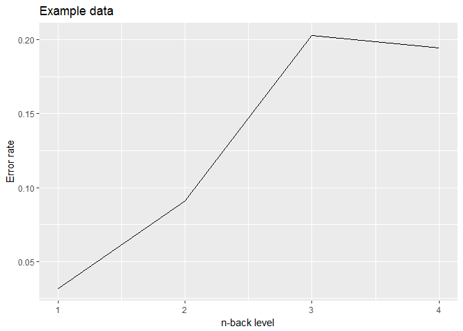

n-back task
================
Jörn Alexander Quent
05 May 2021

-   [General information](#general-information)
-   [Recognition](#recognition)
-   [Description of the task](#description-of-the-task)
-   [Data](#data)
    -   [How to analyse the data in R](#how-to-analyse-the-data-in-r)
-   [References](#references)
-   [License](#license)

General information
===================

**Version:** 1.8

**License:** GPL-2

**URL:** <https://github.com/JAQuent/nBack>

**Contact:** alex.quent (at) mrc-cbu.cam.ac.uk

Recognition
===========

Please recognise this work by citing it.

Description of the task
=======================

I generally followed the approach described by Jaeggi and colleagues (2010; see section 2.2.1.1). Non-verbal stimuli - eight 8-points shapes (number 14, 15, 17, 18, 20, 22, 23, and 27) and two 12-points shapes (number 20 and 24) taken from Vanderplas and Garvin (1959) - are presented to subjects in sequence who are prompted to press the right control key if a stimulus is identical to the stimulus presented n-times back. No key press is required if the stimulus is a non-target. The black stimuli are presented on a white screen for a duration of 500 msec with an interstimulus interval (ISI) of 2500 msec. Therefore the subjects maximally have 3000 msec to give their response. The test levels increases from 2-back to 4-back; each level comprises three blocks, which amounts to nine blocks in total. Each block includes six targets and 14 + n non-targets. I ensure that the same stimulus is not repeated more than three times in a row. Reaction times, hits, false alarms, misses, correct rejections are recorded.

I am sorry that the instructions of the task are in German.

Data
====

How to analyse the data in R
----------------------------

1.  Import the data:

``` r
data <- read.table("results/nBack_example.dat", 
           header= FALSE)

names(data) <- c('subjectNumber', 'date', 'time', 'trialNumber', 'stimulus', 'level', 'block', 'corrAnswer', 'response', 'correctness', 'RT', 'StimulusOnsetTime1','StimulusEndTime1', 'trialTime')

head(data)
```

    ##   subjectNumber     date   time trialNumber stimulus level block
    ## 1             1 20171109 150556           1        8     1     1
    ## 2             1 20171109 150556           2        8     1     1
    ## 3             1 20171109 150556           3        5     1     1
    ## 4             1 20171109 150556           4        5     1     1
    ## 5             1 20171109 150556           5        3     1     1
    ## 6             1 20171109 150556           6        1     1     1
    ##   corrAnswer response correctness       RT StimulusOnsetTime1
    ## 1          0        0           4 -99.0000           14.68156
    ## 2          1        1           1 634.4812           16.71541
    ## 3          0        0           4 -99.0000           16.43049
    ## 4          1        1           1 953.1878           16.28229
    ## 5          0        0           4 -99.0000           17.17728
    ## 6          0        0           4 -99.0000           16.60908
    ##   StimulusEndTime1 trialTime
    ## 1        3048.1452  5548.211
    ## 2         667.8344  3167.889
    ## 3        3047.9408  5548.004
    ## 4         985.9618  3486.016
    ## 5        3034.7877  5534.839
    ## 6        3033.4444  5533.497

An 1 in column correctness means hit, a 2 means false alarm, a 3 means miss and a 4 means correct rejection. Based on this, we can calculate the error rate

``` r
data$errorRate                               <- 0
data$errorRate[which(data$correctness == 2 | data$correctness == 3)] <- 1
```

and aggregate it across the levels.

``` r
library(plyr)
rates <- ddply(data, c('level'), summarise, errorRate = mean(errorRate))
```

Then, we can display the error rate as the function of b-nack level.

``` r
library(ggplot2)
ggplot(rates, aes(x = level, y = errorRate)) +geom_line() + labs(x = 'n-back level', y = 'Error rate', title = 'Example data')
```



Bug fixes
====
In Versions < 1.8, there was a bug so that the ISI was larger than it should when no response is given. 

Articles that use this task
===========================
Samuel D McDougle, Ian C Ballard, Beth Baribault, Sonia J Bishop, Anne G E Collins, Executive Function Assigns Value to Novel Goal-Congruent Outcomes, Cerebral Cortex, 2021;, bhab205, https://doi.org/10.1093/cercor/bhab205

Lei, H., Mochizuki, Y., Chen, C. et al. Sex difference in the weighting of expected uncertainty under chronic stress. Sci Rep 11, 8700 (2021). https://doi.org/10.1038/s41598-021-88155-1

Nakagawa T, Koan I, Chen C, Matsubara T, Hagiwara K, Lei H, Hirotsu M, Yamagata H, Nakagawa S. Regular Moderate- to Vigorous-Intensity Physical Activity Rather Than Walking Is Associated with Enhanced Cognitive Functions and Mental Health in Young Adults. Int J Environ Res Public Health. 2020 Jan 18;17(2):614. https://doi.org/110.3390/ijerph17020614

References
==========

Jaeggi, S. M., Studer-Luethi, B., Buschkuehl, M., Su, Y.-F., Jonides, J., & Perrig, W. J. (2010). The relationship between n-back performance and matrix reasoning - implications for training and transfer. Intelligence, 38(6), 625-635. <https://doi.org/10.1016/j.intell.2010.09.001>

Vanderplas, J. M., & Garvin, E. A. (1959). The association value of random shapes. Journal of Experimental Psychology, 57(3), 147-154. <https://doi.org/10.1037/h0048723>

License
=======

n-back task.

Copyright (C) 2017 Jörn Alexander Quent

This program is free software; you can redistribute it and/or modify it under the terms of the GNU General Public License as published by the Free Software Foundation; either version 2 of the License, or (at your option) any later version.

This program is distributed in the hope that it will be useful, but WITHOUT ANY WARRANTY; without even the implied warranty of MERCHANTABILITY or FITNESS FOR A PARTICULAR PURPOSE. See the GNU General Public License for more details.

You should have received a copy of the GNU General Public License along with this program; if not, write to the Free Software Foundation, Inc., 51 Franklin Street, Fifth Floor, Boston, MA 02110-1301, USA.
